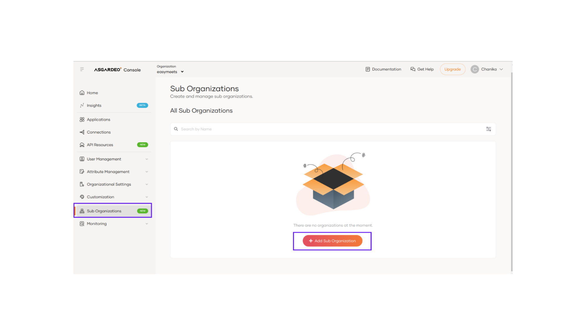
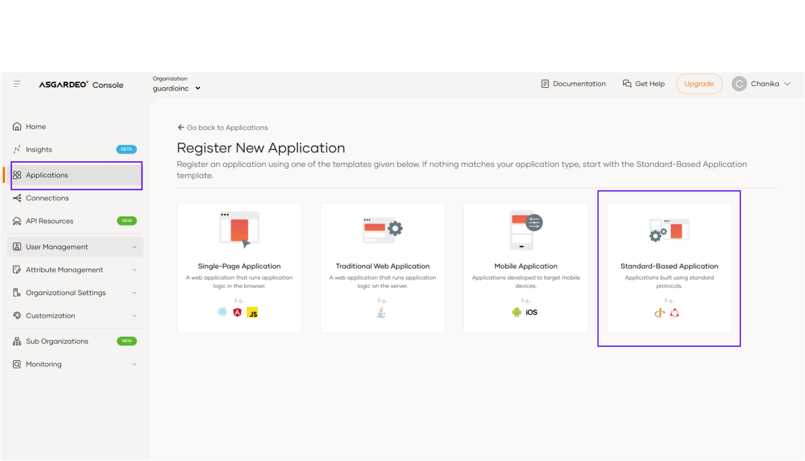
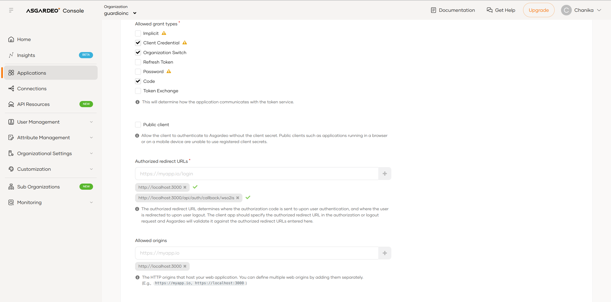
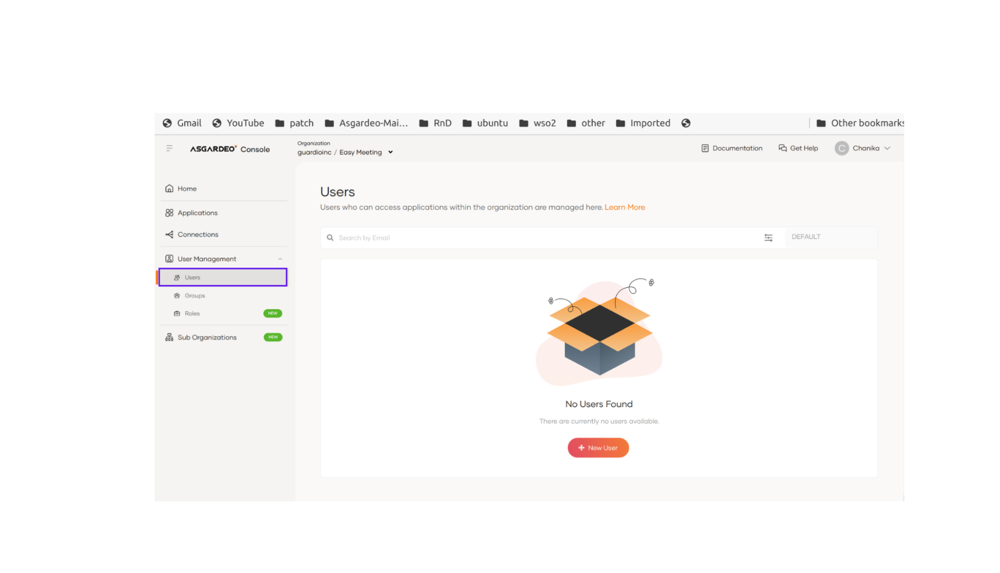
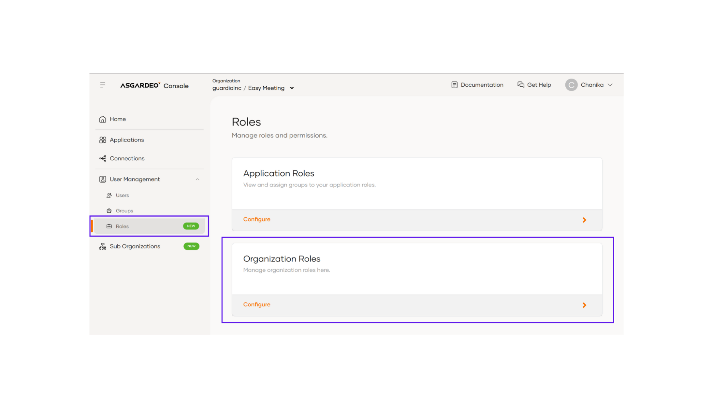
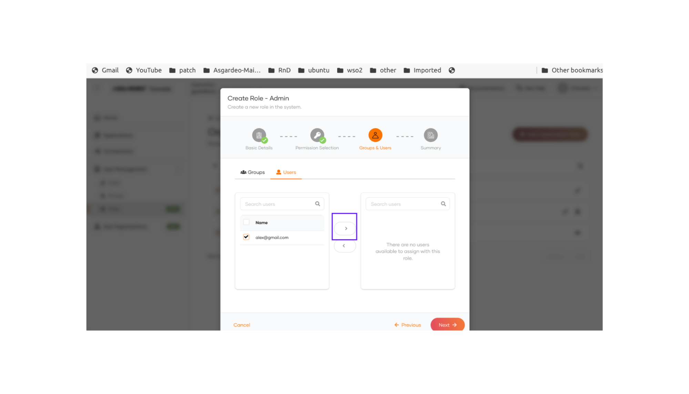

# asgardeo-nextjs-b2b-sample-app

Next.JS sample web application to integrate with Asgardeo for B2B usecases.

## 👀 Live Deployment

A live preview of this demo is available at

1. Vercel: [https://asgardeo-b2b-nextjs-sample-app.vercel.app/](https://asgardeo-b2b-nextjs-sample-app.vercel.app/)

Sample Credentials:

- organization name : Best Car Mart
- username : Alex@gmail.com
- password : Alex@123

## Features/ Capabilities

- Sign In to the sub organization application
- Sign Out of the application
- User profile view and update
- User Management.
  - View all users
  - Add new user
  - Edit user
  - Delete User
- Group Management
  - View groups
  - Add a new group and assign users.
  - Edit group and edit assigned users.
  - Delete group
- Role Management
  - View Role permission
  - View assigned groups
  - Assign new groups
  - Assign external groups
- Idp Management
  - Add Idp ( Google Idp/ Enterprise Idp)
  - Edit Idp settings
  - Add external groups
  - Add Idp to application login flow

## Configure Asgardeo to integrate with your application

### Create a sub organization

1. Access Asgardeo at https://console.asgardeo.io/ and log in.

2. Click **Sub Organizations** in the left navigation menu.

3. Create a new sub organization
   

Refer Documentation : [Set up sub organizations](https://wso2.com/asgardeo/docs/guides/organization-management/manage-b2b-organizations/manage-suborganizations/#prerequisites)

### Create the application

1. Click **Applications** in the left navigation menu.

2. Create a new application

- Select Standard-Based Application.
  

- Fill the details and click register.
  - name : **Guardio-App**
  - click management application.
  - Click **Share Application** button, select the suborganizations with which you want to share the application, and proceed.
  - Select **Share with all sub-organizations**, if you want to share your application with all existing suborganizations and every sub-organization that will be created later.

3. Go to Protocol section and add the following.

> | Property                 |                                      Value/s                                      |
> | ------------------------ | :-------------------------------------------------------------------------------: |
> | Allowed Grant types      |                           `Organization Switch`, `Code`                           |
> | Authorized redirect URLs | `http://localhost:3001/api/auth/callback/wso2isAdmin` and `http://localhost:3001` |
> | Allowed origin           |                              `http://localhost:3001`                              |



4. On the User Attributes tab, click on + Add User Attributes.
   Select `Email`, `First Name`, `Last Name`, and `Username` from the list of attributes. |

Refer Documentation : [Share applications with sub organizations
](https://wso2.com/asgardeo/docs/guides/organization-management/manage-b2b-organizations/share-applications/)

### Create a user and assign roles

You need to create new users on the sub-organizations with the required permissions.
To create a user for Best Auto Mart with all administrative permissions :

1. Click Sub Organization at left navigation panel
2. Use the Organization Switcher to change the organization to Best Car Mart.
3. Click **User Management** at the left navigation panel and select Users.
   

4. Click Add User button and create a user named Alex on the Best Car Mart organization.
5. Create an admin role with all permissions.
6. Click User Management > Roles > Organization Roles> Configure.
   

7. Click Add Organization Role button and create an administrator role.
8. Click next and check all permissions to assign all the permissions to the created role.
9. Click next and select the users tab.
10. Check the checkbox alex and select the front arrow to assign the user to the role.
    

11. create another user named Tom on the Best Auto Mart organization( without assiging roles)

Refer Documentation : [Onboard sub organization administrators.
](https://wso2.com/asgardeo/docs/guides/organization-management/manage-b2b-organizations/onboard-sub-org-admins/#sales-led-approach)

## 🚀 Getting Started

1. Clone the repository.

```bash
git clone https://github.com/ChanikaRuchini/asgardeo-b2b-nextjs-sample-app.git
```

2. Install the dependencies.

```bash
npm install
```

3. Create a `.env` file based on the `.env.example` file.

```bash
cp .env.example .env
```

4. Update the values in the `.env` file based on your requirements.

```bash

# The endpoint of the server's API that the client application will communicate with
# E.g., http://localhost:3000
NEXT_PUBLIC_HOSTED_URL="http://localhost:3000"

# The base URL for the Asgardeo root organization's API
# E.g., https://api.asgardeo.io/t/your-org
NEXT_PUBLIC_ASGARDEO_BASE_ORGANIZATION_URL="https://api.asgardeo.io/t/guardioinc"

# The client ID for the Asgardeo Shared Application
SHARED_APP_CLIENT_ID="<CLIENT ID OF CREATED APP>"

# The client Secret for the Asgardeo Shared Application
SHARED_APP_CLIENT_SECRET="<CLIENT SECRET OF CREATED APP>"

# The name of the Asgardeo Shared Application
SHARED_APPICATION_NAME="Guardio-App"

```

5. Start the development server.

```bash
npm run dev
```

This will start the app on [http://localhost:3000](http://localhost:3000).
Login from the created user `Alex` to the application.

- Type `Best Car Mart` when pop up to type the organization.

## Deploy the application

Go through the following guides and deploy your application in Vercel, Netlify and Choreo.
Vercel : https://vercel.com/guides/deploying-react-with-vercel
Netlify : https://www.netlify.com/with/nextjs/
Choreo : https://wso2.com/choreo/docs/quick-start-guides/build-your-first-cloud-native-application-with-choreo/
